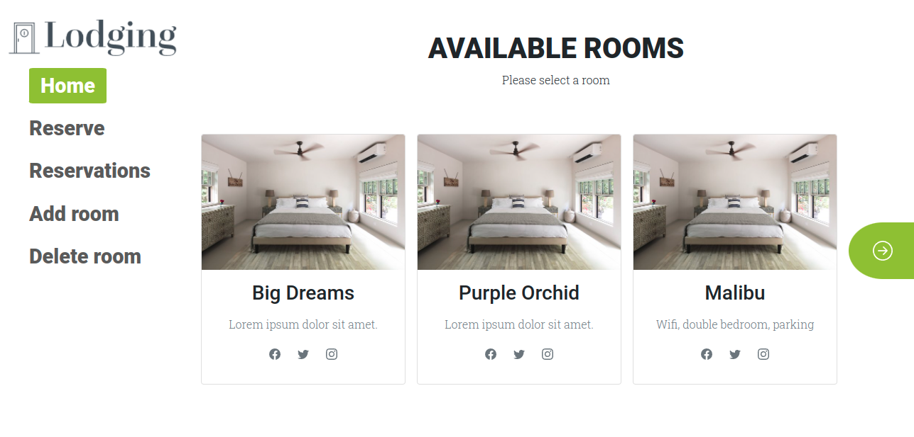
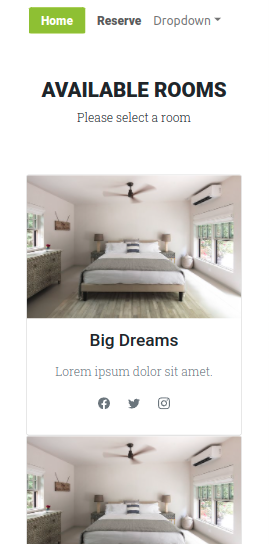

# Lodging App Front-End

> An app to reserve a room in a hotel in an easy way, created using RoR and React, this is the repository for the Front-End.

[RoR Project](https://github.com/nachosala89/lodging-app-backend)

### Desktop version




### Mobile version



## Built With
ReactJs
Redux
React Router
Bootstrap
React-Bootstrap

## Getting Started
- Please, run first the [RoR Project](https://github.com/nachosala89/lodging-app-backend)
- To get a local copy of the repository please run the following commands on your terminal:
   ```
   git clone https://github.com/mike2611/lodging-app-frontend
   ```
- Go to the cloned directory with `cd lodging-app-frontend`
- Run `npm i` to install the necessary packages
- Run the website with `npm run start` 
- It will ask you for permission to run in another port because the RoR project is running in port 3000, press 'y' and then Enter

## Authors

👤 **Miguel Angel Puentes**
- GitHub: [@mike2611](https://github.com/mike2611)
- Twitter: [@MiguelP2611](https://twitter.com/MiguelP2611)
- LinkedIn: [Miguel Puentes Mata](https://linkedin.com/in/miguel-puentes-mata-90a562139/)


👤 **Nacho Sala**

- GitHub: [@nachosala89](https://github.com/nachosala89)
- Twitter: [@nachosala89](https://twitter.com/nachosala89)
- LinkedIn: [Juan Ignacio Sala](https://www.linkedin.com/in/nacho-sala)


👤 **Luis Octavio Ramirez Cruz**

- GitHub: [LOctavio](https://github.com/LOctavio)
- Twitter: [@Octavio_ram431](https://twitter.com/Octavio_ram431)
- LinkedIn: [Luis Octavio Ramirez Cruz](https://www.linkedin.com/in/luis-octavio-ramirez-cruz/) 

## Acknowledgment

- Thanks to Murat Korkmaz, whose [design](https://www.behance.net/gallery/26425031/Vespa-Responsive-Redesign) inspired us for the site layout.

## 🤝 Contributing

Contributions, issues, and feature requests are welcome!

## Show your support

Give a ⭐️ if you like this project!
